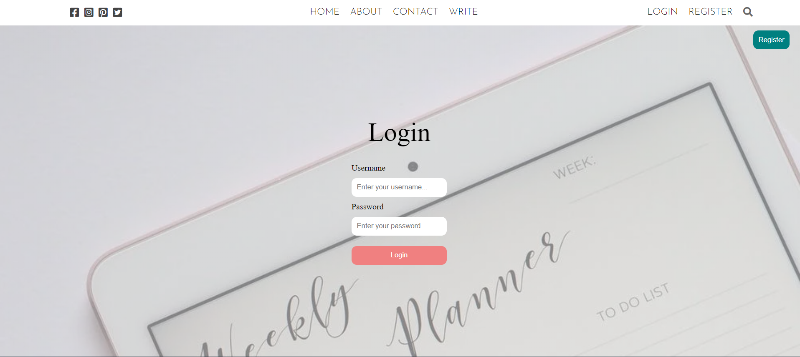
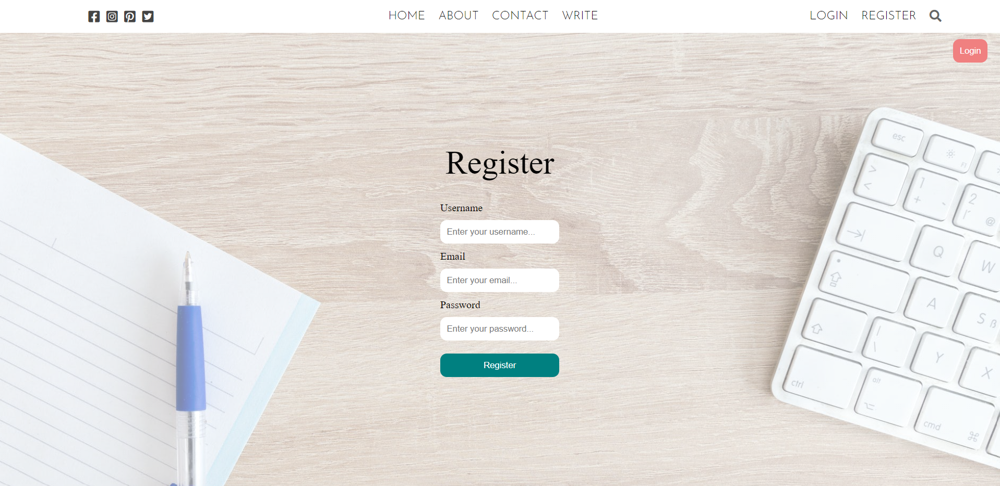

# MERN Blog app

### Description

- This is a small full stack blog app using mern stack.
- I used ReactJS for the frontend part.
- For backend I used NodeJS with ExpressJS.
- For storing data, I used MongoDB as the database.

### Features

- You can register and login and use your account to write new blogs.
- You cannot edit or delete other's posts.
- Blogs can be sorted with accounts and categories.
- User informations can be edited and updated.

### User Interfaces
1. Login Page

2. Register Page

3. Home Page

